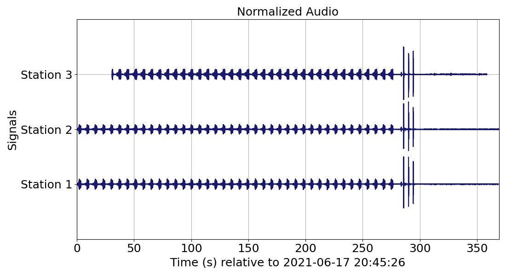
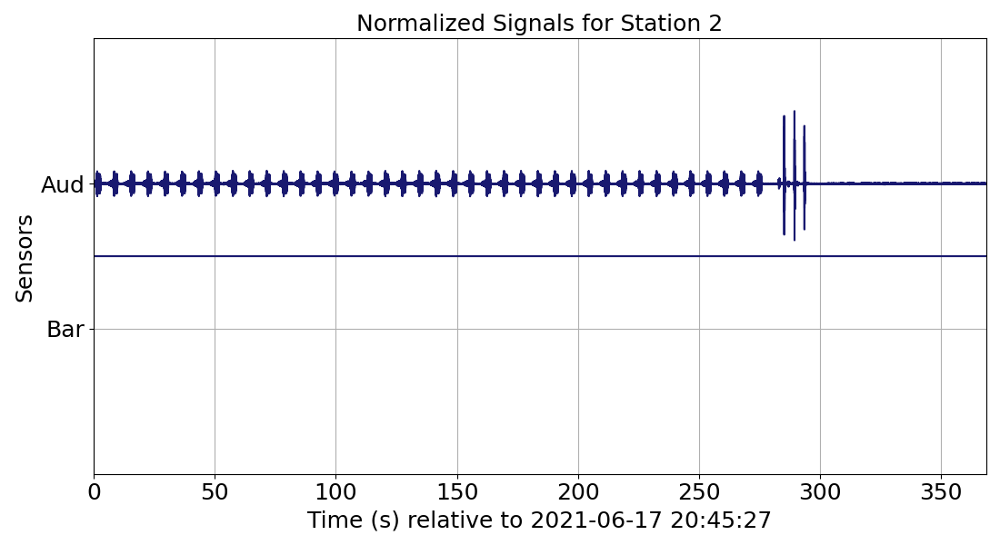

# How to use RedPandas - Advanced data manipulation  

The following subsections showcase features from the RedPandas library once the [RedPandas DataFrame](using_redpandas.md#basic-definitions) 
has been constructed and saved as a [parquet](using_redpandas.md#opening-redvox-data-with-redpandas).  

## Table of Contents

<!-- toc -->

- [Ensonify RedVox data](#ensonify-redvox-data)
- [Plot waveforms](#plot-waveforms)
    - [Plotting signal waveforms for all stations stored in the dataframe](#plotting-signal-waveforms-for-all-stations-stored-in-the-dataframe)
    - [Plotting signal waveforms for only one station](#plotting-signal-waveforms-for-only-one-station)
- [Filter signals](#filter-signals)
    - [Eliminate DC offset](#eliminate-dc-offset)
    - [Add taper](#add-taper)
    - [Normalize signal](#normalize-signal)
- [STFT]()

<!-- tocstop -->
  
  
### Ensonify RedVox data

You can listen to your RedVox dataset using the function ``ensonify_sensors_pandas`` to resample your data.

_Example:_
```python
import pandas as pd
import redpandas.redpd_ensonify as rpd_sound

INPUT_DIR = "path/to/redvox/data"
df = pd.read_parquet(INPUT_DIR + "/rpd_files/Redvox_df.parquet")

sensor_column_label_list = ["audio_wf"]  # List of column labels with sensor waveform data
sensor_fs_label_list = ["audio_sample_rate_nominal_hz"]  # List of column labels with sensor sample rates
sensor_name_key_list = ["aud"]  # Optional: list of labels for saving 

rpd_sound.ensonify_sensors_pandas(df=df,
                                  sig_id_label='station_id',
                                  sensor_column_label_list=sensor_column_label_list,
                                  sig_sample_rate_label_list=sensor_fs_label_list,
                                  wav_sample_rate_hz=192000.,  # 8000., 16000., 48000., and 96000. also available
                                  output_wav_directory=INPUT_DIR,
                                  output_wav_filename='A_cool_example',
                                  sensor_name_list=sensor_name_key_list)

#The number of elements in sensor_column_label_list and sig_sample_rate_label_list should be the same.
```
The .wav files will be located in a folder named ``wav`` in the directory provided in ``output_wav_directory``. You can listen to the .wav files in the free and open-sourced app [Audacity](https://www.audacityteam.org/).


Note that for 3 component sensors, e.g., accelerometer, the optional ``sensor_name_list`` parameter should take into account 
the X, Y and Z components. For example, to ensonify the accelerometer ``sensor_column_label_list = ["accelerometer_wf_raw"]``, ``sensor_fs_label_list = accelerometer_sample_rate_hz``, 
and ``sensor_name_key_list = ["Acc_X", "Acc_Y", "Acc_Z"]``. Do not forget to [unflatten](using_redpandas.md#opening-redpandas-parquet-files) 
the sensor data column for barometer / acceleration / gyroscope / magnetometer data. 


### Plot waveforms

The function ``plot_wiggles_pandas`` is a useful tool to plot signal waveforms stored in the [RedPandas DataFrame](using_redpandas.md#basic-definitions).

#### Plotting signal waveforms for all stations stored in the dataframe
 _Plotting audio for all stations example:_
```python
import pandas as pd
import redpandas.redpd_plot as rpd_plot
import matplotlib.pyplot as plt

df = pd.read_parquet("path/to/parquet/file_name.parquet")


rpd_plot.plot_wiggles_pandas(df=df,
                             sig_wf_label="audio_wf",  # list if multiple signals waveforms
                             sig_sample_rate_label="audio_sample_rate_nominal_hz",  # list if multiple signals waveforms
                             sig_id_label="station_id",
                             x_label="Time (s)",  # Optional
                             y_label="Signals",  # Optional
                             fig_title_show=True,  # Optional
                             fig_title="Audio",  # Optional
                             sig_timestamps_label="audio_epoch_s",  # Optional but more accurate plots if included
                             custom_yticks=["Station 1", "Station 2", "Station 3"])  # Optional

plt.show()

```
The resulting plot is shown below:



In the example shown above, the only signal waveform plotted is audio but multiple signals can also be plotted for all stations. 
For example, the input in the following parameters in ``plot_wiggle_pandas`` 
would change to plot the accelerometer and the audio waveforms for all stations: ``sig_wf_label=["audio_wf", "accelerometer_wf_raw"]``, ``sig_sample_rate_label = ["audio_sample_rate_nominal_hz",
"accelerometer_sample_rate_hz"]``, and optionally, ``fig_title="Audio and Accelerometer"``, ``sig_timestamps_label=["audio_epoch_s",
"accelerometer_epoch_s"]``, and ``custom_yticks=["Station 1 Audio", "Station 1 AccX", "Station 1 AccY", "Station 1 AccZ",
"Station 2 Audio", "Station 2 AccX", "Station 2 AccY", "Station 2 AccZ", "Station 3 Audio", "Station 3 AccX", "Station 3 AccY", 
"Station 3 AccZ"]`` (taking into account the X, Y, and Z components of the accelerometer). For more information on column names, 
visit [RedPandas DataFrame Columns](columns_name.md). Do not forget to [unflatten](using_redpandas.md#opening-redpandas-parquet-files) 
the sensor data column for barometer / acceleration / gyroscope / magnetometer data.

#### Plotting signal waveforms for only one station
Another application of ``plot_wiggles_pandas`` is plotting one station and multiple sensor channels as shown in the following example.
 
  _Plotting audio and barometer for one station example:_
 ```python
rpd_plot.plot_wiggles_pandas(df=df,
                             sig_wf_label=["barometer_wf_raw", "audio_wf"],
                             sig_sample_rate_label=["barometer_sample_rate_hz", "audio_sample_rate_nominal_hz"],
                             sig_id_label="station_id",
                             station_id_str="1637610012",  # Optional: station ID to plot as saved in df
                             x_label="Time (s)",  # Optional
                             y_label="Sensors",  # Optional
                             fig_title_show=True,  # Optional
                             fig_title='Signals for Station 2',  # Optional
                             sig_timestamps_label=['barometer_epoch_s', 'audio_epoch_s'],  # Optional but more accurate plots if included
                             custom_yticks=["Bar", "Aud"])  # Optional
```
The resulting plot is shown below:



In this example, there is no interesting signal in the barometer. If available in the dataset, other sensor waveforms can 
be plotted (visit [RedVox SensorData Documentation](https://github.com/RedVoxInc/redvox-python-sdk/tree/master/docs/python_sdk/data_window/station#sensor-data-dataframe-access)
for more information). Do not forget to [unflatten](using_redpandas.md#opening-redpandas-parquet-files) 
the sensor data column for barometer / acceleration / gyroscope / magnetometer data. 

### Filter signals

The RedPandas library has multiple tools for cleaning and filtering signals in the dataframe.

#### Eliminate DC offset

The function ``signal_zero_mean_pandas`` can be used to eliminate the DC offset in a signal for all stations.

_Eliminate DC offset in audio signal example:_
```python
import redpandas.redpd_filter as rpd_filter
import pandas as pd

df = pd.read_parquet("path/to/parquet/file_name.parquet")
rpd_filter.signal_zero_mean_pandas(df=df,
                                   sig_wf_label="audio_wf")  # signal column label in df
```
The new signal will be stored in a new column  in the [RedPandas Dataframe](using_redpandas.md#basic-definitions)  named ``zero_mean``. The label
can be changed by changing the name provided in the parameter ``new_column_label`` in ``signal_zero_mean_pandas``.

#### Add taper 

A taper can be added to a signal in the [RedPandas Dataframe](using_redpandas.md#basic-definitions) with the function ``
taper_tukey_pandas``.

_Taper edges in audio signal example:_
```python
import redpandas.redpd_filter as rpd_filter
import pandas as pd

df = pd.read_parquet("path/to/parquet/file_name.parquet")
rpd_filter.taper_tukey_pandas(df=df,
                              sig_wf_label="audio_wf",  # signal column label in df
                              fraction_cosine=0.1)  # fraction of the window inside the cosine tapered window, shared between the head and tail
```
The new signal will be stored in a new column  in the [RedPandas Dataframe](using_redpandas.md#basic-definitions)  named ``taper``. The label
can be changed by changing the name provided in the parameter ``new_column_label_append`` in ``taper_tukey_pandas``.


#### Normalize signal

A signal can be normalized using the function ``normalize_pandas``.

_Normalize audio waveform example:_
```python
import redpandas.redpd_filter as rpd_filter
import pandas as pd

df = pd.read_parquet("path/to/parquet/file_name.parquet")
rpd_filter.normalize_pandas(df=df,
                            sig_wf_label="audio_wf")  # signal column label in df
```
The new signal will be stored in a new column  in the [RedPandas Dataframe](using_redpandas.md#basic-definitions)  named ``normalized``. 
The label can be changed by changing the name provided in the parameter ``new_column_label`` in ``normalize_pandas``.

#### Decimate


#### Bandpass
aper and a butterworth bandpass filter

### STFT