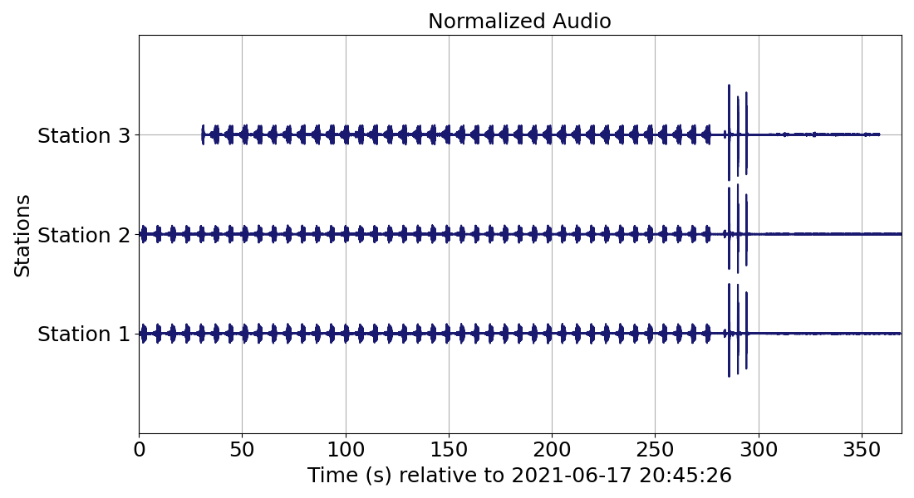
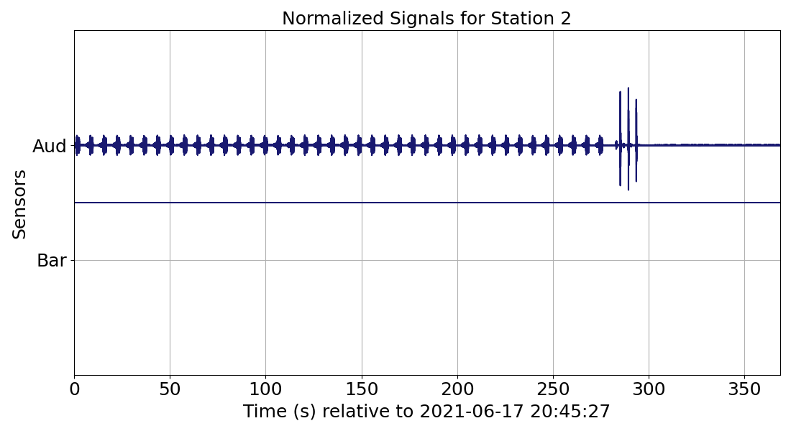
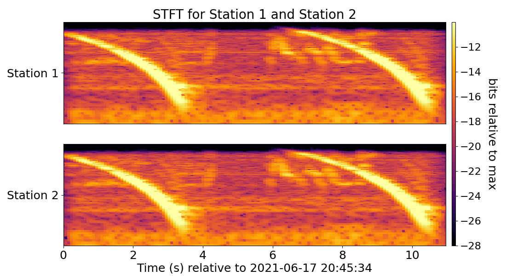

# How to use RedPandas - Advanced data manipulation  

The following subsections showcase features from the RedPandas library once the [RedPandas DataFrame](using_redpandas.md#basic-definitions) 
has been constructed and saved as a [parquet](using_redpandas.md#opening-redvox-data-with-redpandas). While initially coded with 
RedVox data in mind, these functions can be applied to any datasets stored in a [pandas DataFrame](https://pandas.pydata.org/docs/reference/api/pandas.DataFrame.html). 

## Table of Contents

<!-- toc -->

- [Ensonify RedVox data](#ensonify-redvox-data)
- [Plot waveforms](#plot-waveforms)
    - [Plotting signal waveforms for all stations stored in the dataframe](#plotting-signal-waveforms-for-all-stations-stored-in-the-dataframe)
    - [Plotting signal waveforms for only one station](#plotting-signal-waveforms-for-only-one-station)
- [Filter signals](#filter-signals)
    - [Eliminate DC offset](#eliminate-dc-offset)
    - [Add taper](#add-taper)
    - [Normalize signal](#normalize-signal)
    - [Decimate signal](#decimate-signal)
    - [Bandpass signal](#bandpass-signal)
- [Time Frequency Representation](#time-frequency-representation)
    - [Calculating Time Frequency Representation](#calculating-time-frequency-representation)
    - [Plotting time frequency representation](#plotting-time-frequency-representation)

<!-- tocstop -->
  
  
### Ensonify RedVox data

You can listen to your RedVox dataset using the function [ensonify_sensors_pandas](https://redvoxinc.github.io/redpandas/redpd_ensonify.html#redpandas.redpd_ensonify.ensonify_sensors_pandas) 
to resample your data.

_Ensonifying RedVox data example:_
```python
import pandas as pd
import redpandas.redpd_ensonify as rpd_sound

INPUT_DIR = "path/to/redvox/data"
df = pd.read_parquet(INPUT_DIR + "/rpd_files/Redvox_df.parquet")

sensor_column_label_list = ["audio_wf"]  # List of column labels with sensor waveform data
sensor_fs_label_list = ["audio_sample_rate_nominal_hz"]  # List of column labels with sensor sample rates
sensor_name_key_list = ["aud"]  # Optional: list of labels for saving 

rpd_sound.ensonify_sensors_pandas(df=df,
                                  sig_id_label="station_id",
                                  sensor_column_label_list=sensor_column_label_list,
                                  sig_sample_rate_label_list=sensor_fs_label_list,
                                  wav_sample_rate_hz=192000.,  # 8000., 16000., 48000., and 96000. also available
                                  output_wav_directory=INPUT_DIR,
                                  output_wav_filename="A_cool_example",
                                  sensor_name_list=sensor_name_key_list)

#The number of elements in sensor_column_label_list and sig_sample_rate_label_list should be the same.
```
The .wav files will be located in a folder named ``wav`` in the directory provided in teh variable ``output_wav_directory``. The free 
and open-sourced app [Audacity](https://www.audacityteam.org/) can be used to listed to the .wav files.


Note that for 3 component sensors, e.g., accelerometer, the optional ``sensor_name_list`` parameter should take into account 
the X, Y and Z components. For example, to ensonify the accelerometer ``sensor_column_label_list = ["accelerometer_wf_raw"]``, ``sensor_fs_label_list = accelerometer_sample_rate_hz``, 
and ``sensor_name_key_list = ["Acc_X", "Acc_Y", "Acc_Z"]``. Do not forget to [unflatten](using_redpandas.md#opening-redpandas-parquet-files) 
the sensor data column for barometer / acceleration / gyroscope / magnetometer data. 

Return to _[Table of Contents](#table-of-contents)_.

### Plot waveforms

The function [plot_wiggles_pandas](https://redvoxinc.github.io/redpandas/redpd_plot/wiggles.html#redpandas.redpd_plot.wiggles.plot_wiggles_pandas) 
plots signal waveforms stored in the [RedPandas DataFrame](using_redpandas.md#basic-definitions).


#### Plotting signal waveforms for all stations stored in the dataframe
 _Plotting audio for all stations example:_
```python
import pandas as pd
import redpandas.redpd_plot.wiggles as rpd_plot

df = pd.read_parquet("path/to/parquet/file_name.parquet")

rpd_plot.plot_wiggles_pandas(df=df,
                             sig_wf_label="audio_wf",  # list if multiple signals waveforms
                             sig_timestamps_label="audio_epoch_s",  # list if multiple signals waveforms
                             sig_id_label="station_id",
                             fig_title_show=True,  # Optional
                             fig_title="Audio",  # Optional
                             custom_yticks=["Station 1", "Station 2", "Station 3"],  # Optional   
                             show_figure=True)           
```
The resulting plot is shown below:



The function [plot_wiggles_pandas](https://redvoxinc.github.io/redpandas/redpd_plot/wiggles.html#redpandas.redpd_plot.wiggles.plot_wiggles_pandas) 
provides a quick visual check as shown in the example above, where ``Station 3`` has 
an incomplete audio record and therefore the signal might not be useful for further analysis. 

Furthermore, [plot_wiggles_pandas](https://redvoxinc.github.io/redpandas/redpd_plot/wiggles.html#redpandas.redpd_plot.wiggles.plot_wiggles_pandas) can also plot multiple signals for all stations. 
For example, the input in the following parameters in [plot_wiggles_pandas](https://redvoxinc.github.io/redpandas/redpd_plot/wiggles.html#redpandas.redpd_plot.wiggles.plot_wiggles_pandas) 
would change to plot the accelerometer and the audio waveforms for all stations: ``sig_wf_label=["audio_wf", "accelerometer_wf_raw"]``, 
``sig_timestamps_label = ["audio_epoch_s","acceleroemter_epoch_s"]`` 
and optionally, ``fig_title="Audio and Accelerometer"``, and ``custom_yticks=["Station 1 Audio", "Station 1 AccX", "Station 1 AccY", "Station 1 AccZ",
"Station 2 Audio", "Station 2 AccX", "Station 2 AccY", "Station 2 AccZ", "Station 3 Audio", "Station 3 AccX", "Station 3 AccY", 
"Station 3 AccZ"]`` (taking into account the X, Y, and Z components of the accelerometer). For more information on column names, 
visit [RedPandas DataFrame Columns](columns_name.md). Do not forget to [unflatten](using_redpandas.md#opening-redpandas-parquet-files) 
the sensor data column for barometer / acceleration / gyroscope / magnetometer data.

Return to _[Table of Contents](#table-of-contents)_.

#### Plotting signal waveforms for only one station
Another application of [plot_wiggles_pandas](https://redvoxinc.github.io/redpandas/redpd_plot/wiggles.html#redpandas.redpd_plot.wiggles.plot_wiggles_pandas) 
is plotting one station and multiple sensor channels as shown in the following example.
 
  _Plotting audio and barometer for one station example:_
 ```python
import pandas as pd
import redpandas.redpd_plot.wiggles as rpd_plot

df = pd.read_parquet("path/to/parquet/file_name.parquet")

rpd_plot.plot_wiggles_pandas(df=df,
                             sig_wf_label=["barometer_wf_raw", "audio_wf"],
                             sig_timestamps_label=["barometer_epoch_s", "audio_epoch_s"],
                             sig_id_label="station_id",
                             station_id_str="1637610012",  # Optional: station ID to plot as saved in df
                             fig_title_show=True,  # Optional
                             fig_title="Signals for Station 2",  # Optional
                             custom_yticks=["Bar", "Aud"])  # Optional
```
The resulting plot is shown below:



In this example, there is no interesting signal in the barometer. If available in the dataset, other sensor waveforms can 
be plotted (visit [RedVox SensorData Documentation](https://github.com/RedVoxInc/redvox-python-sdk/tree/master/docs/python_sdk/data_window/station#sensor-data-dataframe-access)
for more information). Do not forget to [unflatten](using_redpandas.md#opening-redpandas-parquet-files) 
the sensor data column for barometer / acceleration / gyroscope / magnetometer data. 

Return to _[Table of Contents](#table-of-contents)_.

### Filter signals

The RedPandas library has multiple tools for cleaning and filtering signals stored in the dataframe.

#### Eliminate DC offset

The function [signal_zero_mean_pandas](https://redvoxinc.github.io/redpandas/redpd_filter.html#redpandas.redpd_filter.signal_zero_mean_pandas) 
can be used to eliminate the DC offset in a signal for all stations.

_Eliminate DC offset in audio signal example:_
```python
import redpandas.redpd_filter as rpd_filter
import pandas as pd

df = pd.read_parquet("path/to/parquet/file_name.parquet")
rpd_filter.signal_zero_mean_pandas(df=df,
                                   sig_wf_label="audio_wf")  # signal column label in df
```
The new signal will be stored in a new column in the [RedPandas Dataframe](using_redpandas.md#basic-definitions)  named ``zero_mean``. The label
can be changed by changing the name provided in the parameter ``new_column_label`` in [signal_zero_mean_pandas](https://redvoxinc.github.io/redpandas/redpd_filter.html#redpandas.redpd_filter.signal_zero_mean_pandas).

Return to _[Table of Contents](#table-of-contents)_.

#### Add taper 

A taper can be added to a signal in the [RedPandas Dataframe](using_redpandas.md#basic-definitions) with the function 
[taper_tukey_pandas](https://redvoxinc.github.io/redpandas/redpd_filter.html#redpandas.redpd_filter.taper_tukey_pandas).

_Taper edges in audio signal example:_
```python
import redpandas.redpd_filter as rpd_filter
import pandas as pd

df = pd.read_parquet("path/to/parquet/file_name.parquet")
rpd_filter.taper_tukey_pandas(df=df,
                              sig_wf_label="audio_wf",  # signal column label in df
                              fraction_cosine=0.1)  # fraction of the window inside the cosine tapered window, shared between the head and tail
```
The new signal will be stored in a new column in the [RedPandas Dataframe](using_redpandas.md#basic-definitions)  named ``taper``. The label
can be changed by changing the name provided in the parameter ``new_column_label_append`` in [taper_tukey_pandas](https://redvoxinc.github.io/redpandas/redpd_filter.html#redpandas.redpd_filter.taper_tukey_pandas).

Return to _[Table of Contents](#table-of-contents)_.

#### Normalize signal

A signal can be normalized using the function [normalize_pandas](https://redvoxinc.github.io/redpandas/redpd_filter.html#redpandas.redpd_filter.normalize_pandas).

_Normalize audio waveform example:_
```python
import redpandas.redpd_filter as rpd_filter
import pandas as pd

df = pd.read_parquet("path/to/parquet/file_name.parquet")
rpd_filter.normalize_pandas(df=df,
                            sig_wf_label="audio_wf")  # signal column label in df
```
The new signal will be stored in a new column in the [RedPandas Dataframe](using_redpandas.md#basic-definitions)  named ``normalized``. 
The label can be changed by changing the name provided in the parameter ``new_column_label`` in [normalize_pandas](https://redvoxinc.github.io/redpandas/redpd_filter.html#redpandas.redpd_filter.normalize_pandas).

Return to _[Table of Contents](#table-of-contents)_.

#### Decimate signal

A signal can be decimated using the function [decimate_signal_pandas](https://redvoxinc.github.io/redpandas/redpd_filter.html#redpandas.redpd_filter.decimate_signal_pandas).

_Decimate audio waveform example:_
```python
import redpandas.redpd_filter as rpd_filter
import pandas as pd

df = pd.read_parquet("path/to/parquet/file_name.parquet")
rpd_filter.decimate_signal_pandas(df=df,
                                  downsample_frequency_hz=20,  # can also be 'Min' to decimate to minimum sample rate among all the stations
                                  sig_id_label="station_id",
                                  sig_wf_label="audio_wf",
                                  sig_timestamps_label="audio_epoch_s",
                                  sample_rate_hz_label="audio_sample_rate_nominal_hz")
```

The new signal will be stored in a new column in the [RedPandas Dataframe](using_redpandas.md#basic-definitions)  named 
``decimated_sig_data``. The decimated timestamps and sample rate will be stored in new columns named ``decimated_sig_epoch``
and ``decimated_sample_rate_hz`` respectively. The labels for these three columns can be changed by changing the names provided 
in the parameters ``new_column_label_decimated_sig``, ``new_column_label_decimated_sig_timestamps``, and ``new_column_label_decimated_sample_rate_hz``
in [decimate_signal_pandas](https://redvoxinc.github.io/redpandas/redpd_filter.html#redpandas.redpd_filter.decimate_signal_pandas).

Return to _[Table of Contents](#table-of-contents)_.                                                                                      
                                                                                      
#### Bandpass signal
A bandpass filter can be applied to a signal using the [bandpass_butter_pandas](https://redvoxinc.github.io/redpandas/redpd_filter.html#redpandas.redpd_filter.bandpass_butter_pandas) 
function. 

_Bandpass audio example_:
```python
import redpandas.redpd_filter as rpd_filter
import pandas as pd

df = pd.read_parquet("path/to/parquet/file_name.parquet")
rpd_filter.bandpass_butter_pandas(df=df,
                                  sig_wf_label="audio_wf",
                                  sig_sample_rate_label="audio_sample_rate_nominal_hz",
                                  frequency_cut_low_hz=180.,
                                  frequency_cut_high_hz=240.,
                                  filter_order=4,
                                  tukey_alpha=0.25)

```
The new signal will be stored in a new column in the [RedPandas Dataframe](using_redpandas.md#basic-definitions)  named 
``bandpass``. The low and high frequency cutoff used will be in columns ``frequency_low_hz`` and ``frequency_high_hz``.
The labels for these three columns can be changed by changing the names provided 
in the parameters ``new_column_label_sig_bandpass``, ``new_column_label_frequency_low``, and ``new_column_label_frequency_high``
in [bandpass_butter_pandas](https://redvoxinc.github.io/redpandas/redpd_filter.html#redpandas.redpd_filter.bandpass_butter_pandas).

Return to _[Table of Contents](#table-of-contents)_.

### Time Frequency Representation

The following subsections focus on calculating and plotting time frequency representation. 

#### Calculating Time Frequency Representation

The function [tfr_bits_panda](https://redvoxinc.github.io/redpandas/redpd_tfr.html#redpandas.redpd_tfr.tfr_bits_panda) 
can be used to calculate time-frequency analysis.

_Calculating TFR for audio example_:
```python
import redpandas.redpd_tfr as rpd_tfr
import pandas as pd

df = pd.read_parquet("path/to/parquet/file_name.parquet")
rpd_tfr.tfr_bits_panda(df=df,
                       sig_wf_label="audio_wf",
                       sig_sample_rate_label="audio_sample_rate_nominal_hz",
                       order_number_input=12,  # Optional, default=3
                       tfr_type="stft")  # Optional, 'stft' or 'cwt, default='stft'
```

The calculated time frequency representation bits will be stored in a new column in the [RedPandas Dataframe](using_redpandas.md#basic-definitions) named 
``tfr_bits``. The time and frequency will be in columns ``tfr_time_s`` and ``tfr_frequency_hz``.
The labels for these three columns can be changed by changing the names provided 
in the parameters ``new_column_tfr_bits``, ``new_column_tfr_time_s``, and ``new_column_tfr_frequency_hz`` in 
[tfr_bits_panda](https://redvoxinc.github.io/redpandas/redpd_tfr.html#redpandas.redpd_tfr.tfr_bits_panda).

#### Plotting Time Frequency Representation

Once the TFR has been calculated, ``tfr_bits`` can be plotted with the function [plot_mesh_pandas](https://redvoxinc.github.io/redpandas/redpd_plot/mesh.html#redpandas.redpd_plot.mesh.plot_mesh_pandas).

_Plotting TFR for audio signal from a [previous example](#plotting-signal-waveforms-for-all-stations-stored-in-the-dataframe):_
```python
import redpandas.redpd_plot.redpd_plot.mesh as rpd_plot
import matplotlib.pyplot as plt

df = df.drop(index=2)  # eliminate Station 3 because it does not have a complete record as we saw in the previous example
rpd_plot.plot_mesh_pandas(df=df,
                          mesh_time_label="tfr_time_s",
                          mesh_frequency_label="tfr_frequency_hz",
                          mesh_tfr_label="tfr_bits",
                          t0_sig_epoch_s=df["audio_epoch_s"][0][0],
                          frequency_hz_ymin=20,
                          sig_id_label=["Station 1", "Station 2"],
                          fig_title="STFT for Station 1 and Station 2")
plt.show()
```

The resulting plot is shown below:



The function [plot_mesh_pandas](https://redvoxinc.github.io/redpandas/redpd_plot/mesh.html#redpandas.redpd_plot.mesh.plot_mesh_pandas)
can be adjusted with the variables ``frequency_scaling``, ``frequency_hz_ymin``, ``frequency_hz_ymax``, for y-axis manipulation,
``fig_title_show`` and ``fig_title``, for publication, and ``common_colorbar``, ``mesh_color_scaling`` and ``mesh_color_range`` 
for dynamic range adjustments. Visit [plot_mesh_pandas](https://redvoxinc.github.io/redpandas/redpd_plot/mesh.html#redpandas.redpd_plot.mesh.plot_mesh_pandas)
for defaults and more options.

Return to _[Table of Contents](#table-of-contents)_.

Return to _[main page](https://github.com/RedVoxInc/redpandas#redpandas)_.